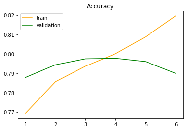
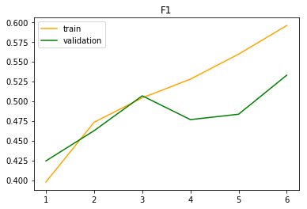

## Introduction
### Motivation
I believe that many people dislike spoilers just like me, especially for the upcoming movies, TV series, and animes. Although
I think I am quite tolerant to them, the moment I saw a key plot shown in Weibo's frontpage before I went to see the Avengers: Endgame,
I felt really frustrated. At that time, I am developing a classifier to detect toxic online forum contents. So I came up with the idea of developing a neural network model to detect spoilers. I even thought of add this feature to the toxic content detector, since spoilers themselves are indeed toxic, too. But I do not find proper dataset at that time. Fortunately, just one month later, I found [IMDB movie information and user review dataset with spoiler label](https://www.kaggle.com/rmisra/imdb-spoiler-dataset). It contains ~1300 different movies' information, and ~570k user reviews on them.
### Data preprocessing
The original dataset has actually two files, one contains movie information: movie ID, genre, duration, plot summary etc, 25 columns in total, and the other contains user review: user ID, movie ID, review summary, review detail, label etc, 7 columns in total. For this task, the most directly related features should be movie's ~~plot summary~~ [*Edit*: Actually another field: plot_synopsis is more useful since it gives out much more details than plot_summary], user's review summary (or title), review detail and the label. I would guess that rating might also have something to do with spoiling, since if people either very satisfied or unsatisfied with a movie might be more likely to give out key plot in review due to their strong emotion related to it. (Suppose your favorite character in GoT suddenly died, would you give a low score, write the death in your review and kindly greet the scriptwriter) But now I only feed the three field aforementioned to the network. Extracting these three features is relatively easy, just load the two json files as data frame and do a natural join on movie ID. The code can be found in [data_loader](./data_loader.ipynb).
## Model
### Manhattan LSTM
Firstly I tried manhattan LSTM (malstm), this model was introduced in a [paper](https://www.aaai.org/ocs/index.php/AAAI/AAAI16/paper/download/12195/12023) published on AAAI'16. It intends to measure the similarity between twn sentences, so I think it might be able to connect summary with spoiler. The model works as follows.
- Use single direction LSTM to embed two input sentences into vectors $\vec{v_1}$, $\vec{v_2}$. 
- Calculate the manhattan distance between these two vectors $vec{d}=\vec{v_1}-\vec{v_2}$.
- Compute $\exp(-\vec{d})$, intuitively, this value is closer to 1 if $\vec{d}$ is small, i.e., two vector representations are alike. Thus we can use it to detect similarity in two sentences. However, when using this model on IMDB dataset, I found that it can only output the most common label although it worked on Quora duplicate question pair dataset. I think there are several reasons:
- In Quora dataset, the lengths of questions are usually small, in fact, fewer of them exceed 50 words. But for IMDB dataset, the average length of review is 300 words, and that of plot summary is 100 words. This will result in LSTM memorizing a lot of information, which has long been a problem of its structure.
- The spoiler in review might be very short, and takes a fairly small portion. So the review and plot summary can be quite different while the former still contains a spoiler. On this occasion, measure the element-wise is not reasonable and can produce inaccurate prediction.
In fact, when tested on this model, I found that for short plot and one sentence review (also a spoiler) made up by myself, it could predicts the right label. But for IMDB dataset, it failed to produce useful result.
### Self-attention sentence embedding
This is the second model I used. The difference from malstm is that the sentence embedding changed from a vanilla LSTM to four layers of LSTM followed by a self attention layer. This self-attentive sentence embedding model was introduced in a [paper](https://arxiv.org/pdf/1703.03130.pdf) published on ICLR'17. I will briefly describe the core computation here.
Suppose that we have obtained a sentence embedding $\vec{E}$ for a sequence of words of length $n$ with a bi-lstm whose hidden layer size is u. Then $\vec{E}$ is of shape $n\cdot 2u$. First we multiply its transpose with matrix $W_1$ of shape $d_a\cdot 2u$. The result is thus a matrix of shape $d_a\cdot n$ and apply $\tanh$ activation on it. This extracts the information of this embedding. Then we multiply the result again with a matrix (vector) $w_2$ of shape $1\cdot d_a$. After this operation, the matrix is reduced to a $1\cdot n$ weight vector followed by a softmax, hence each entry of this vector is the weight of the corresponding word embedding, i.e., attention. I will call it $\vec{att}$.
After the aforementioned computation on the sentence embedding, we will multiply $\vec{att}$ with the original sentence embedding $E$ along each column. This concludes one hop of attention. If we want to apply several hops of attention, we can substitute $w_2^{1\cdot d_a}$ with a matrix $W_2^{r\cdot d_a}$, where $r$ is the number of hops. With this model, I have achieved ~92% accuracy on test dataset of 80k samples, and 75% accuracy on validation dataset of 20k samples. While the F1 score is ~.82 and ~.47, respectively.
### Enhanced LSTM for natural language inference (ESIM)
I find this task similar to natural language inference to some degree, which aims to determine the logical relationship between a premise and hypothesis as entailment, neural or contradiction. Adapted to spoiler detection, the premise is the plot summary and the hypothesis is the review. However, the relationships now only contain entailment (is a spoiler) and neural (not a spoiler). The model I use is introduced in [this paper](https://arxiv.org/abs/1609.06038) published in ACL'17, with some simplification. I will introduce two important layers here. 
#### Sentence embedding and first bi-lstm pass
Suppose that we already have sentence embedding $\vec{p}^{l_p\times e}$ and $\vec{h}^{l_h\times e}$ for premise and hypothesis, respectively. After feeding them into a shared $d$-dimensional bi-lstm, we obtain the hidden output $\bar{\vec{p}}^{l_p\times 2d}$ and $\bar{\vec{h}}^{l_h\times 2d}$ as their semantic representations.
#### Soft alignment
This layer computes the similarity between two hidden outputs from $\bar{\vec{p}}$ and $\bar{\vec{h}}$ with dot product. For example, let $\bar{\vec{p_i}}$ represent the $i$-th word in premise, and $\bar{\vec{h_j}}$ represent the $j$-th word in hypothesis, then $e_{ij}=\bar{\vec{p_i}}^\mathbf{T}\cdot \bar{\vec{h_i}}$ is the similarity score between them. From sentence level, it is computed as $\vec{E}^{l_p\times l_h}=\bar{\vec{p}}\cdot \bar{\vec{h}}^\mathbf{T}$. Then $\vec{E}$ is multiplied with $\bar{\vec{p}}$ and $\bar{\vec{h}}$ in the following way:
$$
\tilde{\vec{p}}=\text{softmax}(\vec{E})\cdot \bar{\vec{h}}\\
\tilde{\vec{h}}=\text{softmax}(\vec{E^\mathbf{T}})\cdot \bar{\vec{p}}
$$
where the softmax is applied on along the columns of input matrix.
#### Information enhancement and composition
After calculating these hidden representations, it is expected that their combinations can help improve performance, which is $\vec{m}_p=[\bar{\vec{p}};\tilde{\vec{p}};\bar{\vec{p}}-\tilde{\vec{p}};\bar{\vec{p}}∘\tilde{\vec{p}}]$, and $\vec{m}_h=[\bar{\vec{h}};\tilde{\vec{h}};\bar{\vec{h}}-\tilde{\vec{h}};\bar{\vec{h}}∘\tilde{\vec{h}}]$. The information is further composited with another bi-lstm different from the one used for encoding sentence. The outputs are thus $\vec{v}_p^{l_p\times 2u}$ and $\vec{v}_h^{l_h\times 2u}$.
#### Pooling and output layer
Both average and max pooling are applied on the matrix $\vec{v}_{\frac{p}{h}}$ along the rows. The result is four $2u$-dimensional vectors, i.e., $\vec{v}_{p,\text{ avg}}$, $\vec{v}_{p,\text{ max}}$, $\vec{v}_{h,\text{ avg}}$, and $\vec{v}_{h,\text{ max}}$. They are concatenated together and connected to the final fc layer to produce output.
#### Visualize result
The training and validation accuracy and f1 score curves are as follows.

